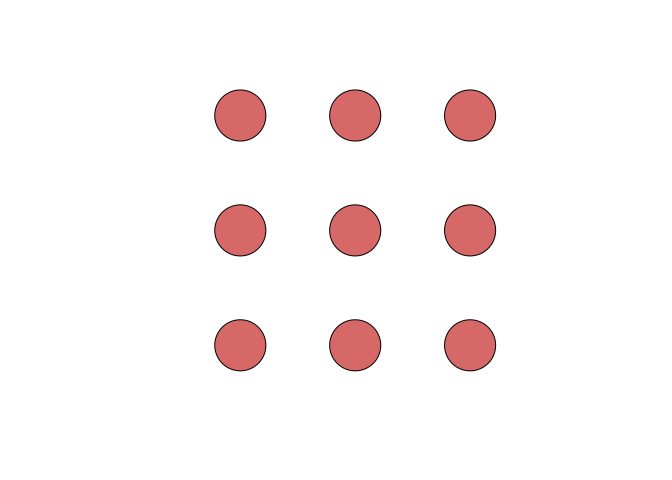
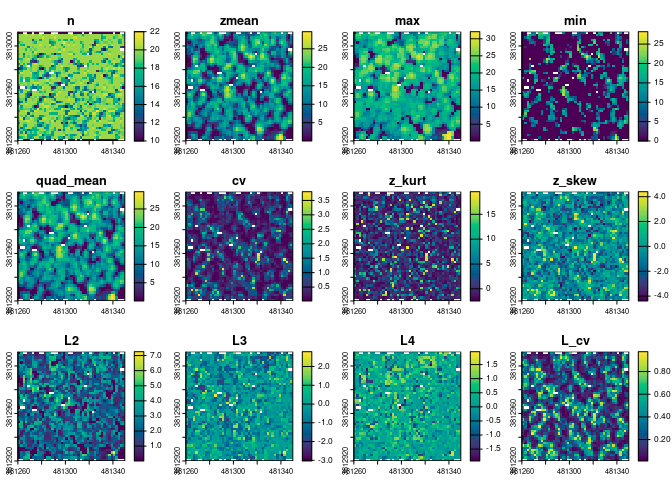
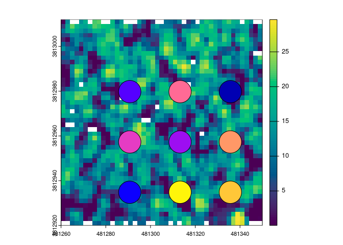

# generating LiDAR metrics with the lidR package.

The code used in these examples is taken from the following publication:

Michael J Mahoney, Lucas K Johnson, Eddie Bevilacqua & Colin M Beier
(2022) Filtering ground noise from LiDAR returns produces inferior
models of forest aboveground biomass in heterogenous landscapes,
GIScience & Remote Sensing, 59:1, 1266-1280, DOI:
10.1080/15481603.2022.2103069

## Example:

First, we load the required libraries and the source functions. The
`lidar-metrics.R` file contains the functions that are used to generate
the metrics.

``` r
suppressPackageStartupMessages({
  library(lidR)
  library(proceduralnames) # used in the source functions.
  library(terra)
  library(sf)
})

source("lidar-metrics.R")
```

Then we load up some example data and of a point cloud of trees and
create some fake plots to extract metrics from.

``` r
# load an example dataset from the lidR package
LASfile <- system.file("extdata", "MixedConifer.laz", package = "lidR")
trees <- readLAS(LASfile, filter = "-drop_z_below 0")

# plot(trees) to view the point cloud data in 3D

# make some fake plots:
tree_crs <- st_crs(trees)
trees_bbox <- lidR::st_bbox(trees) |>
  sf::st_as_sfc()
trees_cent <- st_centroid(trees_bbox)
plot_max_ext <- (trees_bbox - trees_cent) * 0.75 + trees_cent
fake_plots <- sf::st_sample(x = plot_max_ext, size = 9, type = "regular") |>
  sf::st_buffer(5) |>
  sf::st_set_crs(tree_crs)

plot(fake_plots, col = "#cc4040c9")
```

<!-- -->

The `compute_pixel_metrics` function is a wrapper around
`lidR::pixel_metrics` that generates 40 metrics from the point cloud
data and saves them to a raster file.

``` r
# This uses the `compute_pixel_metrics` which is a wrapper around
# `lidR::pixel_metrics`. It generates 40 rastersied metrics from the
# point cloud data.
gridded_metrics <- compute_pixel_metrics(
  trees,
  res = 2,
  output_filename = "grid_metrics.tif"
)
gm <- terra::rast(gridded_metrics)
print(names(gm))
```

    ##  [1] "n"           "zmean"       "max"         "min"         "quad_mean"  
    ##  [6] "cv"          "z_kurt"      "z_skew"      "L2"          "L3"         
    ## [11] "L4"          "L_cv"        "L_skew"      "L_kurt"      "h10"        
    ## [16] "h20"         "h30"         "h40"         "h50"         "h60"        
    ## [21] "h70"         "h80"         "h90"         "h95"         "h99"        
    ## [26] "d10"         "d20"         "d30"         "d40"         "d50"        
    ## [31] "d60"         "d70"         "d80"         "d90"         "cancov"     
    ## [36] "quad_mean_c" "zmean_c"     "cv_c"        "hvol"        "rpc1"

``` r
plot(gm[[1:12]], col = hcl.colors(100, "viridis"))
```

<!-- -->

The `compute_plot_metrics` function is a wrapper around
`lidR::plot_metrics` that generates metrics for a set of polygons. The
`rh_preds` function is a reduced/modified version of the `lidar_preds`
function in the “lidar-metrics.R” script that can be used with
`lidR::plot_metrics` to generate relative height metrics at 1 percentile
intervals.

``` r
# now to extract metrics for these plots we use `compute`
plot_metrics_sf <- compute_plot_metrics(trees, geometry = fake_plots) |>
  sf::st_as_sf()
print(plot_metrics_sf)
```

    ## Simple feature collection with 9 features and 40 fields
    ## Geometry type: POLYGON
    ## Dimension:     XY
    ## Bounding box:  xmin: 481285.7 ymin: 3812930 xmax: 481340.7 ymax: 3812985
    ## Projected CRS: NAD83 / UTM zone 12N
    ##     n     zmean   max  min quad_mean        cv     z_kurt     z_skew       L2
    ## 1 371 12.667466 20.19 0.00  13.61539 0.3945663  0.4299871 -1.0716520 2.688853
    ## 2 347 14.064438 26.11 0.00  16.98074 0.6775131 -1.3412911 -0.4673196 5.300614
    ## 3 335 12.442448 26.04 0.00  14.96557 0.6693467 -1.4277621 -0.1542294 4.761612
    ## 4 340  6.692618 23.09 0.00  10.59899 1.2298392 -1.0007554  0.7875682 4.313862
    ## 5 360 10.472778 21.61 0.00  13.15030 0.7604602 -1.6261777 -0.3892487 4.316514
    ## 6 346 14.504538 24.23 0.01  16.15030 0.4904078  0.1414895 -1.2090949 3.631510
    ## 7 371  9.617358 20.81 0.00  11.89342 0.7285346 -1.4238382 -0.2706877 3.945884
    ## 8 362 13.947956 23.33 0.00  15.46067 0.4788576 -0.2143810 -0.8426465 3.675348
    ## 9 370  5.808514 20.60 0.00   8.74187 1.1262695 -1.5159070  0.4696203 3.478084
    ##           L3         L4      L_cv      L_skew      L_kurt   h10    h20    h30
    ## 1 -0.6891878  0.3233064 0.2122644 -0.25631295  0.12023954 6.110  8.070 11.010
    ## 2 -0.6972216 -0.3788791 0.3768806 -0.13153601 -0.07147834 0.070  0.142  9.450
    ## 3 -0.2350279 -0.2975110 0.3826909 -0.04935889 -0.06248115 0.084  4.008  6.690
    ## 4  1.4427196 -0.1879525 0.6445702  0.33443808 -0.04356944 0.020  0.040  0.080
    ## 5 -0.4546257 -0.5203100 0.4121651 -0.10532243 -0.12053941 0.050  0.110  0.245
    ## 6 -1.0914952  0.5223684 0.2503706 -0.30056236  0.14384330 0.115 11.270 14.805
    ## 7 -0.2309886 -0.2943429 0.4102877 -0.05853913 -0.07459492 0.060  0.130  2.410
    ## 8 -0.7285169  0.3344065 0.2635044 -0.19821711  0.09098636 0.161  9.622 11.860
    ## 9  0.8304321 -0.4197884 0.5987907  0.23876139 -0.12069530 0.040  0.080  0.110
    ##      h40    h50    h60    h70    h80    h90     h95     h99       d10       d20
    ## 1 12.960 14.560 15.220 15.920 16.410 17.490 18.4200 19.7450 0.9326146 0.9245283
    ## 2 14.198 17.380 19.156 21.320 23.258 24.758 25.3250 26.0462 0.7319885 0.7291066
    ## 3  8.522 12.600 17.698 19.458 20.824 22.918 23.3830 24.8062 0.8268657 0.7641791
    ## 4  0.130  0.435  6.266 10.445 17.608 20.316 21.4435 22.8422 0.4647059 0.4441176
    ## 5 12.434 14.530 15.534 16.370 17.812 18.894 19.5245 20.7423 0.6500000 0.6500000
    ## 6 16.180 16.770 17.600 18.445 19.660 20.980 22.0275 23.5265 0.8294798 0.8294798
    ## 7  8.960 11.230 12.950 14.780 16.470 18.250 18.8700 20.1030 0.7008086 0.6927224
    ## 8 13.844 15.555 16.770 18.115 20.056 21.268 22.1290 22.9678 0.8839779 0.8563536
    ## 9  0.150  0.615  8.078 11.539 13.632 14.991 15.7455 17.3161 0.4621622 0.4567568
    ##         d30       d40       d50       d60       d70        d80         d90
    ## 1 0.9029650 0.7978437 0.7331536 0.6657682 0.5336927 0.25067385 0.061994609
    ## 2 0.7233429 0.6570605 0.6224784 0.5475504 0.4466859 0.33429395 0.172910663
    ## 3 0.6507463 0.5462687 0.4895522 0.4507463 0.3731343 0.20000000 0.044776119
    ## 4 0.3823529 0.3323529 0.2735294 0.2558824 0.2205882 0.16470588 0.091176471
    ## 5 0.6388889 0.6222222 0.6111111 0.5777778 0.4333333 0.24166667 0.052777778
    ## 6 0.8265896 0.8121387 0.7947977 0.7109827 0.4653179 0.21965318 0.057803468
    ## 7 0.6819407 0.6226415 0.5363881 0.4393531 0.3234501 0.18059299 0.064690027
    ## 8 0.8397790 0.8093923 0.7071823 0.5883978 0.4392265 0.26243094 0.135359116
    ## 9 0.4108108 0.4000000 0.3594595 0.2729730 0.1567568 0.02432432 0.008108108
    ##      cancov quad_mean_c  zmean_c      cv_c      hvol rpc1
    ## 1 0.9326146    14.09865 13.57503 0.2808218 11.813863    1
    ## 2 0.7319885    19.84716 19.17008 0.2686463 10.295007    1
    ## 3 0.8268657    16.45787 15.02913 0.4470882 10.288233    1
    ## 4 0.4735294    15.59246 14.31159 0.4338278  3.169151    1
    ## 5 0.6527778    16.30961 16.03030 0.1878887  6.836397    1
    ## 6 0.8294798    17.73273 17.46540 0.1759392 12.031220    1
    ## 7 0.7035040    14.23243 13.69780 0.2826532  6.765851    1
    ## 8 0.8839779    16.44397 15.76797 0.2964050 12.329685    1
    ## 9 0.4621622    12.85575 12.37830 0.2812327  2.684475    1
    ##                         geometry
    ## 1 POLYGON ((481295.7 3812935,...
    ## 2 POLYGON ((481318.2 3812935,...
    ## 3 POLYGON ((481340.7 3812935,...
    ## 4 POLYGON ((481295.7 3812957,...
    ## 5 POLYGON ((481318.2 3812957,...
    ## 6 POLYGON ((481340.7 3812957,...
    ## 7 POLYGON ((481295.7 3812980,...
    ## 8 POLYGON ((481318.2 3812980,...
    ## 9 POLYGON ((481340.7 3812980,...

``` r
# or if you just want relative height metrics at 1 percentile intervals you
# can use:
rh_mets_sf <- lidR::plot_metrics(
  trees,
  func = rh_preds(Z),
  geometry = fake_plots
) |>
  sf::st_as_sf()
print(rh_mets_sf)
```

    ## Simple feature collection with 9 features and 100 fields
    ## Geometry type: POLYGON
    ## Dimension:     XY
    ## Bounding box:  xmin: 481285.7 ymin: 3812930 xmax: 481340.7 ymax: 3812985
    ## Projected CRS: NAD83 / UTM zone 12N
    ##      rh1    rh2    rh3    rh4   rh5    rh6    rh7    rh8    rh9  rh10   rh11
    ## 1 0.0270 0.0540 0.0710 0.1000 0.165 0.2520 3.1590 5.0420 5.6520 6.110 6.4200
    ## 2 0.0046 0.0100 0.0200 0.0284 0.030 0.0400 0.0400 0.0500 0.0600 0.070 0.0706
    ## 3 0.0034 0.0168 0.0304 0.0500 0.057 0.0600 0.0600 0.0700 0.0800 0.084 0.0900
    ## 4 0.0000 0.0100 0.0100 0.0100 0.010 0.0200 0.0200 0.0200 0.0200 0.020 0.0300
    ## 5 0.0100 0.0100 0.0100 0.0200 0.020 0.0300 0.0300 0.0300 0.0400 0.050 0.0500
    ## 6 0.0200 0.0300 0.0400 0.0500 0.070 0.0800 0.0815 0.0900 0.1005 0.115 0.1200
    ## 7 0.0100 0.0100 0.0200 0.0300 0.030 0.0400 0.0400 0.0500 0.0500 0.060 0.0600
    ## 8 0.0161 0.0200 0.0383 0.0500 0.060 0.0700 0.0900 0.1088 0.1249 0.161 0.1971
    ## 9 0.0000 0.0038 0.0100 0.0176 0.020 0.0214 0.0300 0.0352 0.0400 0.040 0.0500
    ##     rh12   rh13   rh14   rh15   rh16   rh17   rh18    rh19   rh20    rh21
    ## 1 6.7240 7.0650 7.1380 7.1950 7.3060 7.3990 7.5080  7.7100  8.070  8.2470
    ## 2 0.0900 0.0900 0.1100 0.1100 0.1100 0.1200 0.1300  0.1374  0.142  0.1500
    ## 3 0.1000 0.1200 0.1300 0.1620 0.2188 0.3012 3.4632  3.8200  4.008  4.4278
    ## 4 0.0300 0.0307 0.0400 0.0400 0.0400 0.0400 0.0400  0.0400  0.040  0.0500
    ## 5 0.0600 0.0600 0.0700 0.0800 0.0900 0.0900 0.0900  0.1000  0.110  0.1200
    ## 6 0.1300 0.1300 0.1600 0.1700 0.1940 4.5880 7.8070 11.0515 11.270 12.1900
    ## 7 0.0700 0.0800 0.0880 0.1000 0.1000 0.1100 0.1160  0.1230  0.130  0.1400
    ## 8 3.5204 4.1179 4.4156 5.2465 7.0188 8.5374 8.6998  9.2040  9.622  9.8181
    ## 9 0.0500 0.0500 0.0500 0.0600 0.0600 0.0673 0.0700  0.0700  0.080  0.0800
    ##      rh22    rh23    rh24   rh25    rh26    rh27    rh28    rh29   rh30    rh31
    ## 1  8.9600  9.1800  9.2900  9.425  9.7440 10.4660 10.7900 10.8790 11.010 11.2060
    ## 2  0.1700  0.1858  0.2104  0.270  0.5496  4.1458  8.0560  8.9982  9.450  9.6852
    ## 3  4.9244  5.1246  5.2532  5.300  5.6200  5.7390  5.8364  6.0962  6.690  7.1950
    ## 4  0.0500  0.0500  0.0600  0.060  0.0700  0.0700  0.0700  0.0700  0.080  0.0800
    ## 5  0.1300  0.1300  0.1400  0.155  0.1600  0.1800  0.1800  0.1922  0.245  0.3058
    ## 6 12.7030 12.9870 13.2620 13.355 13.5780 14.1205 14.3460 14.5640 14.805 15.0190
    ## 7  0.1500  0.1800  0.2000  0.225  0.2840  0.3400  0.5160  0.7720  2.410  5.8850
    ## 8 10.5484 10.6509 10.7840 10.950 11.0658 11.2935 11.5016 11.5700 11.860 11.9100
    ## 9  0.0900  0.0900  0.0900  0.090  0.0900  0.1000  0.1000  0.1100  0.110  0.1100
    ##      rh32    rh33    rh34    rh35    rh36    rh37    rh38    rh39   rh40
    ## 1 11.8640 12.0560 12.2320 12.3500 12.4420 12.6260 12.8280 12.9030 12.960
    ## 2  9.9564 10.1472 10.3556 11.2390 12.0504 12.6136 13.2716 13.7758 14.198
    ## 3  7.5176  7.5900  7.6500  7.8070  8.0072  8.1848  8.2592  8.3700  8.522
    ## 4  0.0900  0.0900  0.1000  0.1065  0.1100  0.1100  0.1100  0.1200  0.130
    ## 5  0.3828  0.4482  0.7724  4.5715  6.2212  7.8750  9.3696 10.9368 12.434
    ## 6 15.0940 15.2270 15.3320 15.5075 15.7060 15.9060 16.0510 16.1120 16.180
    ## 7  6.4600  6.6630  7.3920  7.6700  7.7520  8.2670  8.3420  8.6870  8.960
    ## 8 11.9652 12.2130 12.4418 12.5970 12.6388 12.9757 13.3514 13.6737 13.844
    ## 9  0.1100  0.1200  0.1300  0.1300  0.1384  0.1400  0.1500  0.1500  0.150
    ##      rh41    rh42    rh43    rh44    rh45    rh46    rh47    rh48    rh49
    ## 1 13.1600 13.2480 13.6400 13.7080 13.7750 13.9680 14.1580 14.2820 14.4990
    ## 2 14.8016 15.0728 15.3090 15.4544 15.5810 16.1240 16.3224 16.5064 16.8394
    ## 3  8.7100  8.8608  9.4082  9.6444  9.8240 10.7828 11.0598 11.5792 12.3196
    ## 4  0.1400  0.1500  0.1600  0.1616  0.1800  0.1994  0.2432  0.2972  0.3411
    ## 5 12.6795 12.9146 13.1337 13.3748 13.7530 13.9282 14.2392 14.3628 14.4373
    ## 6 16.2625 16.3490 16.3735 16.4000 16.5200 16.5870 16.6015 16.6520 16.7015
    ## 7  9.2770  9.4640  9.8330  9.8800 10.0800 10.3720 10.6610 10.7640 10.9930
    ## 8 13.9901 14.2062 14.4515 14.5384 14.7645 14.9018 14.9967 15.3396 15.4967
    ## 9  0.1600  0.1700  0.1700  0.1800  0.1900  0.2074  0.2529  0.4400  0.5124
    ##     rh50    rh51    rh52    rh53    rh54    rh55    rh56    rh57    rh58
    ## 1 14.560 14.5800 14.6660 14.7130 14.8280 14.8600 14.8820 15.0150 15.1000
    ## 2 17.380 17.6038 17.6884 17.9114 18.0136 18.2120 18.4628 18.6344 18.7536
    ## 3 12.600 13.1156 14.0900 14.4910 14.5780 15.6240 16.2124 16.6676 16.7844
    ## 4  0.435  0.5389  0.6640  2.0468  2.6664  4.0170  4.8528  4.9969  5.5548
    ## 5 14.530 14.5809 14.6536 14.7054 14.7600 14.9525 15.0300 15.2567 15.3444
    ## 6 16.770 16.7900 16.8640 16.9585 17.0130 17.0575 17.1140 17.1925 17.3430
    ## 7 11.230 11.4340 11.7880 11.8570 12.0620 12.4150 12.4740 12.5820 12.7360
    ## 8 15.555 15.6444 15.7672 15.8099 15.9794 16.1300 16.3264 16.4585 16.6200
    ## 9  0.615  0.7057  0.7800  0.9427  3.3022  4.9065  5.0900  5.4698  5.8218
    ##      rh59   rh60    rh61    rh62    rh63    rh64    rh65    rh66    rh67
    ## 1 15.1730 15.220 15.3670 15.4040 15.5240 15.5860 15.6450 15.7120 15.7590
    ## 2 18.8728 19.156 19.4590 20.0900 20.3468 20.5144 20.6250 20.7100 20.9828
    ## 3 17.3022 17.698 17.9118 17.9616 18.2952 18.4228 18.6840 18.7996 18.9756
    ## 4  6.0905  6.266  6.3900  7.0872  7.4614  7.8804  8.7775  8.8770  9.4069
    ## 5 15.4243 15.534 15.6097 15.7074 15.7500 15.7852 15.9000 15.9670 16.0465
    ## 6 17.4985 17.600 17.7435 17.7970 17.9070 17.9580 18.1025 18.1440 18.1975
    ## 7 12.8260 12.950 13.3300 13.4480 13.6600 14.1560 14.2550 14.4120 14.4870
    ## 8 16.7399 16.770 16.8526 17.0774 17.2486 17.3412 17.6065 17.6708 17.8961
    ## 9  6.7622  8.078  8.7871  9.2436  9.9847 10.2576 10.5000 10.5916 10.8046
    ##      rh68    rh69   rh70    rh71    rh72    rh73    rh74    rh75    rh76
    ## 1 15.7760 15.8390 15.920 15.9810 16.0200 16.0620 16.1060 16.1500 16.2020
    ## 2 21.0512 21.2122 21.320 21.5428 21.8336 22.0132 22.2336 22.5500 22.6784
    ## 3 19.1324 19.3646 19.458 19.6140 19.8448 20.0046 20.2832 20.3700 20.4684
    ## 4  9.6988 10.0792 10.445 10.7721 11.2640 11.5894 12.4112 13.9725 14.5944
    ## 5 16.1560 16.2871 16.370 16.4589 16.6300 16.8835 17.0432 17.1925 17.3036
    ## 6 18.3100 18.3600 18.445 18.6570 18.7440 18.8170 18.9700 19.0525 19.2600
    ## 7 14.5700 14.6390 14.780 15.1100 15.3000 15.3610 15.4060 15.5050 15.6980
    ## 8 17.9644 18.0218 18.115 18.3231 18.4192 18.5177 18.7198 19.0750 19.1836
    ## 9 10.9500 11.3354 11.539 11.8493 12.1948 12.4511 12.6830 13.0250 13.2984
    ##      rh77    rh78    rh79   rh80    rh81    rh82    rh83    rh84    rh85
    ## 1 16.2480 16.3160 16.3630 16.410 16.5050 16.5940 16.6510 16.8160 16.9500
    ## 2 22.8184 22.9104 23.0968 23.258 23.3000 23.4516 23.5254 23.7124 24.1210
    ## 3 20.6336 20.7212 20.7686 20.824 20.9416 21.2340 21.4462 21.6424 21.8070
    ## 4 15.2547 16.1236 16.3815 17.608 17.8518 18.1198 18.3737 18.7312 19.4215
    ## 5 17.3929 17.5300 17.6061 17.812 17.8995 17.9500 18.2461 18.3300 18.4700
    ## 6 19.3200 19.3540 19.4855 19.660 19.8845 19.9190 20.0470 20.0980 20.1450
    ## 7 15.8520 16.1020 16.3260 16.470 16.5320 16.6260 16.8090 17.0960 17.3900
    ## 8 19.3897 19.5370 19.7557 20.056 20.2600 20.4304 20.5578 20.6572 20.7355
    ## 9 13.4813 13.5182 13.5602 13.632 13.7900 13.9106 14.1081 14.3972 14.4830
    ##      rh86    rh87    rh88    rh89   rh90    rh91    rh92    rh93    rh94
    ## 1 17.1140 17.2290 17.3340 17.4500 17.490 17.6360 17.7300 18.0600 18.2760
    ## 2 24.3112 24.3808 24.4948 24.6894 24.758 24.7900 24.8932 24.9278 25.1272
    ## 3 21.9772 22.0732 22.4676 22.6486 22.918 23.0094 23.1140 23.2186 23.3492
    ## 4 19.7832 19.9772 20.0732 20.1955 20.316 20.6615 21.0940 21.1454 21.2564
    ## 5 18.5322 18.5796 18.7392 18.8008 18.894 19.1169 19.2328 19.3574 19.3900
    ## 6 20.2700 20.3490 20.4360 20.6235 20.980 21.2450 21.4720 21.5585 21.7690
    ## 7 17.5400 17.7360 17.9440 18.1160 18.250 18.3810 18.5000 18.6470 18.7680
    ## 8 20.8592 21.0207 21.1200 21.2087 21.268 21.4404 21.6124 21.7646 21.8902
    ## 9 14.5600 14.6403 14.7460 14.8733 14.991 15.0200 15.2144 15.5368 15.6472
    ##      rh95    rh96    rh97    rh98    rh99 rh100                       geometry
    ## 1 18.4200 18.5340 18.7980 19.1340 19.7450 20.19 POLYGON ((481295.7 3812935,...
    ## 2 25.3250 25.4908 25.7244 25.9164 26.0462 26.11 POLYGON ((481318.2 3812935,...
    ## 3 23.3830 23.4956 23.6480 23.9740 24.8062 26.04 POLYGON ((481340.7 3812935,...
    ## 4 21.4435 21.9084 22.1630 22.7186 22.8422 23.09 POLYGON ((481295.7 3812957,...
    ## 5 19.5245 19.8820 20.0737 20.2300 20.7423 21.61 POLYGON ((481318.2 3812957,...
    ## 6 22.0275 22.3620 22.4530 22.9140 23.5265 24.23 POLYGON ((481340.7 3812957,...
    ## 7 18.8700 18.9360 19.0350 19.2120 20.1030 20.81 POLYGON ((481295.7 3812980,...
    ## 8 22.1290 22.2612 22.6168 22.6978 22.9678 23.33 POLYGON ((481318.2 3812980,...
    ## 9 15.7455 16.0068 16.1544 16.6420 17.3161 20.60 POLYGON ((481340.7 3812980,...

``` r
# the rh_preds function is just a reduced/modified version of the lidar_preds
# these examples should demonstrate how to build any custom functions that
# can be used with `lidR::plot_metrics` or `lidR::pixel_metrics`


plot(gm[[2]], col = hcl.colors(100, "viridis"))
plot(rh_mets_sf["rh99"], add = TRUE, key.pos = 1, axes = TRUE, axes = TRUE)
```

<!-- -->
